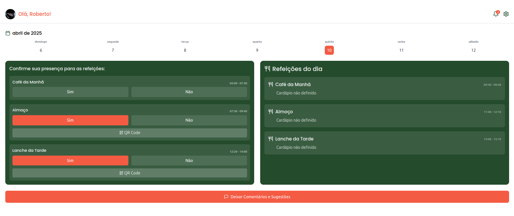

# 🍽️ Vamos Merendar

<p align="center">
  
</p>

<p align="center">
  <strong>Aplicativo moderno para organização e controle de merendas escolares e comunitárias.</strong><br />
  Construído com tecnologias de ponta para proporcionar uma experiência acessível, responsiva e eficiente.
</p>

<p align="center">
  <a href="https://vamos-merendar.vercel.app" target="_blank">
    
  </a>
  <a href="https://github.com/MaxwellMaciel/vamos-merendar" target="_blank">
    
  </a>
</p>

---

## 📸 Demonstração

<p align="center">
  
</p>

> 🔗 Acesse: [vamos-merendar.vercel.app](https://vamos-merendar.vercel.app)

---

## ✨ Funcionalidades

- Cadastro e autenticação de usuários
- Gerenciamento de perfis
- Criação e edição de listas de merenda
- Visualização semanal de cardápios
- Painel de configurações personalizadas
- Interface moderna, responsiva e acessível
- Integração com Supabase (auth e banco de dados)

---

## 🛠️ Tecnologias Utilizadas

<div align="center">

| Frontend                    | Backend                           | UI/Estilo                                | Utilitários                                 |
| --------------------------- | --------------------------------- | ---------------------------------------- | ------------------------------------------- |
| [React](https://react.dev/) | [Supabase](https://supabase.com/) | [TailwindCSS](https://tailwindcss.com/)  | [TypeScript](https://www.typescriptlang.org/) |
| [Vite](https://vitejs.dev/) | —                                 | [Radix UI](https://www.radix-ui.com/)    | [Shadcn UI](https://ui.shadcn.com/)          |

</div>

---

## 📦 Instalação

```bash
# 1. Clone o repositório
git clone https://github.com/MaxwellMaciel/vamos-merendar.git
cd vamos-merendar

# 2. Instale as dependências
npm install
# ou
yarn install
````

> ⚠️ **Crie um arquivo `.env` com as credenciais do Supabase:**

```
VITE_SUPABASE_URL=your_supabase_url
VITE_SUPABASE_ANON_KEY=your_supabase_key
```

```bash
# 3. Inicie o projeto localmente
npm run dev
# ou
yarn dev
```

➡ Acesse: [http://localhost:5173](http://localhost:5173)

---

## 📁 Estrutura do Projeto

```bash
vamos-merendar/
├── public/              # Arquivos públicos (logo, imagens, favicon etc.)
├── src/
│   ├── components/      # Componentes reutilizáveis
│   ├── hooks/           # Hooks personalizados
│   ├── integrations/    # Conexões externas (ex: Supabase)
│   ├── pages/           # Páginas da aplicação
│   └── styles/          # Estilos globais ou utilitários
├── supabase/            # Arquivos relacionados ao backend Supabase
├── .env.example         # Template de variáveis de ambiente
├── vite.config.ts       # Configurações do Vite
└── package.json
```

---

## 🤝 Contribuindo

Quer contribuir? Siga os passos abaixo:

1. Faça um fork do projeto
2. Crie uma nova branch:

```bash
git checkout -b feature/nova-feature
```

3. Commit suas alterações:

```bash
git commit -m "feat: nova feature"
```

4. Envie sua branch:

```bash
git push origin feature/nova-feature
```

5. Abra um Pull Request

---

## 📄 Licença

Este projeto está licenciado sob os termos da [Licença MIT](LICENSE).

---

## 📬 Contato

Feito com 💙 por [Maxwell Maciel](https://github.com/MaxwellMaciel).
Feedbacks, ideias e colaborações são sempre bem-vindos!

<p align="center">
  
</p>

